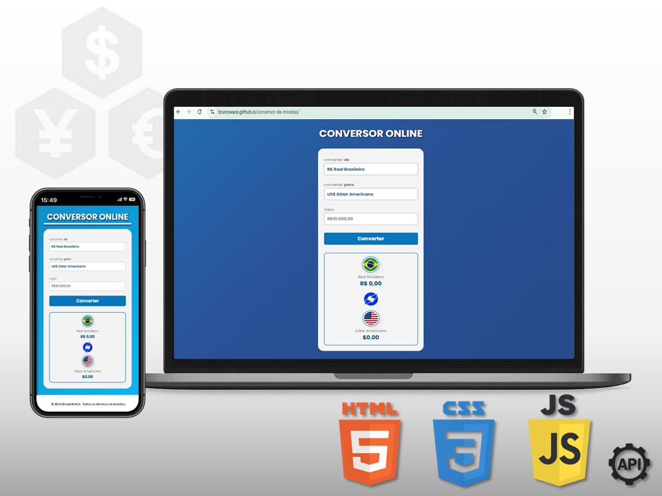

# 💱 CONVERSOR DE MOEDAS ONLINE

Bem-vindo ao meu **Conversor de Moedas Online** feito com **HTML, CSS e JavaScript**!  
Projeto front-end de conversão de moedas em tempo real usando JavaScript e API pública de câmbio. Feito com HTML, CSS, JS — totalmente responsivo e com visual moderno. Este projeto foi criado para praticar a manipulação de DOM, eventos, lógica condicional e chamadas de API com `fetch()` — tudo isso em uma aplicação útil e com **interface responsiva e moderna**.  
Foi desenvolvido como parte dos meus estudos no <a href="https://rodolfomori.com.br" target="_blank">DevClub</a>.

---

## 💡 Como funciona

- Selecione a moeda de **origem** e a **de destino**
- Digite o valor a ser convertido
- Clique em **Converter**
- O sistema exibe o valor convertido com **formatação local e bandeiras**

---

## 🧪 Tecnologias usadas

| Tecnologia | Descrição |
|------------|------------|
|  | Estrutura da página |
| | Estilização e responsividade |
| | Lógica do conversor e consumo de API |
| | Taxas de câmbio atualizadas em tempo real |
| | Layout adaptado para smartphones |

---

## 📱 Responsivo

Sim! O projeto foi desenvolvido com **mobile first**, ou seja:
- Estilização adaptada para telas menores
- Campos maiores para toque
- Layout centralizado e limpo

---

## 🔁 Funcionalidades

- ✅ Conversão em tempo real com API externa
- ✅ Suporte a BRL, USD, EUR e JPY
- ✅ Bandeiras e nomes personalizados
- ✅ Formatação local de moeda com `Intl.NumberFormat`
- ✅ Feedbacks de erro caso a API falhe

---

## 🖼️ Preview do Projeto

  

---

## 🚀 Link do Projeto
[Acesse o Conversor de Moedas Online]

  

---

